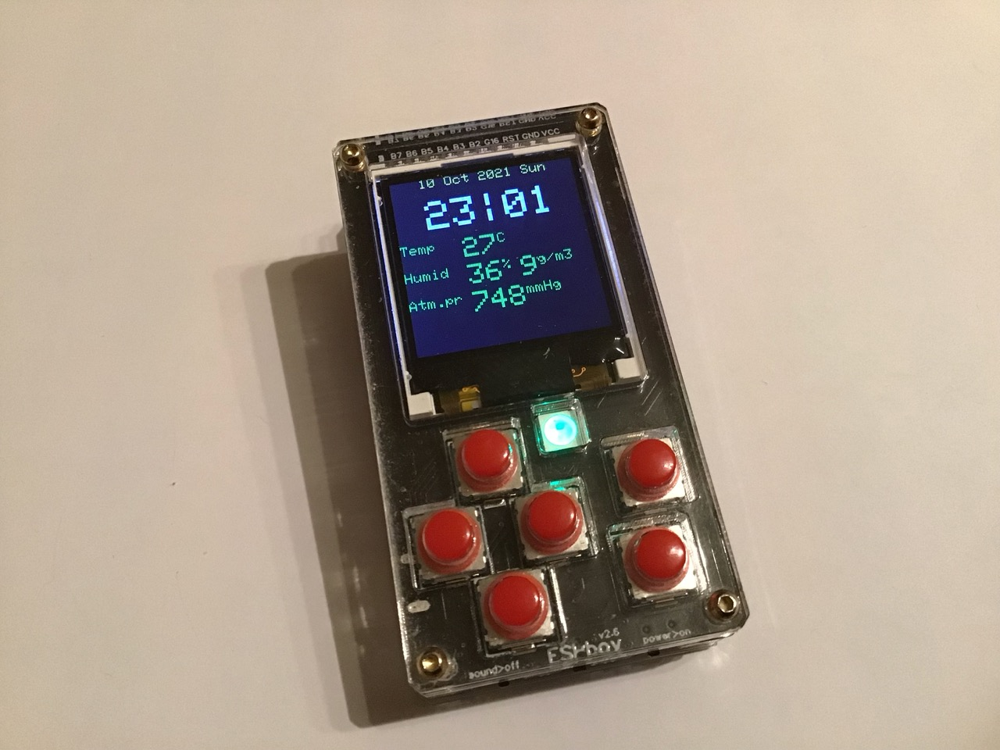
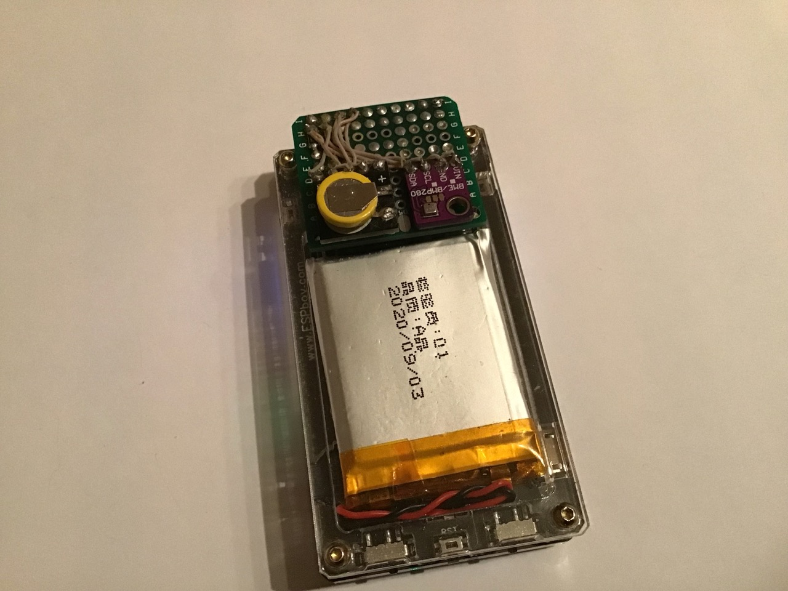
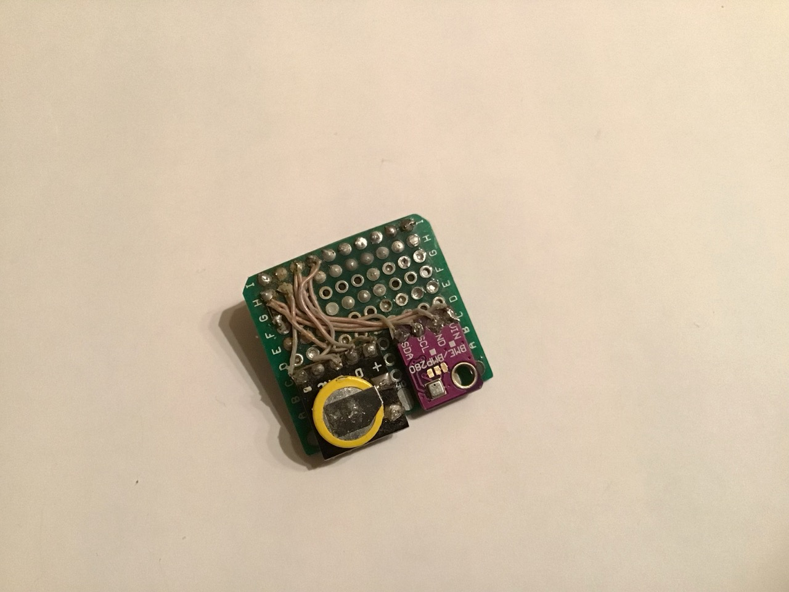
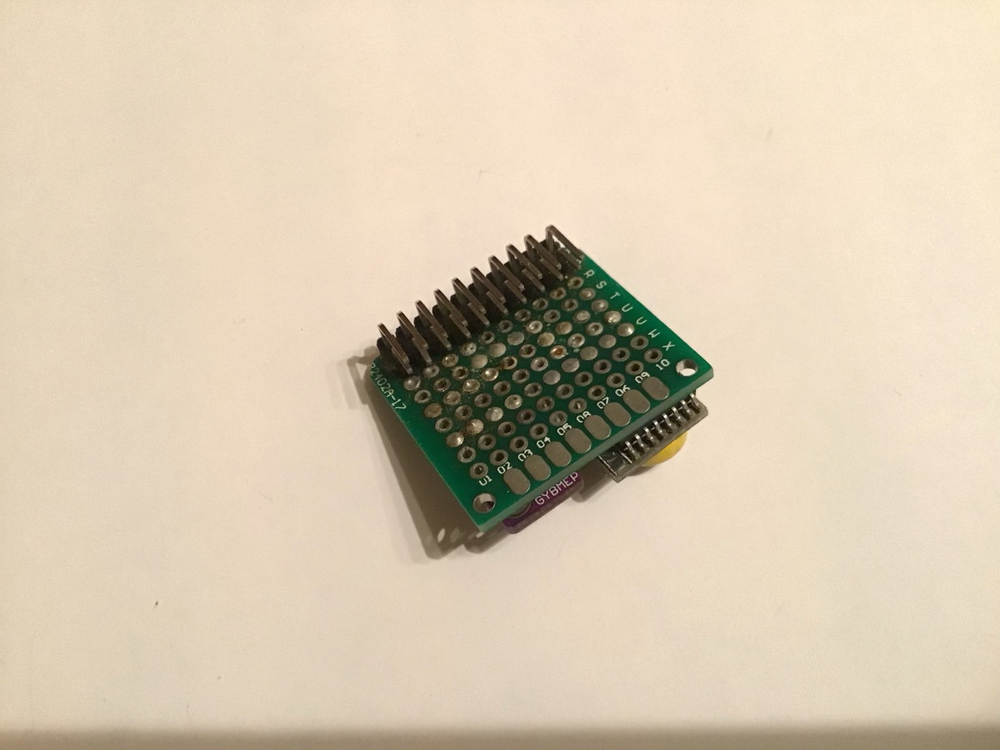
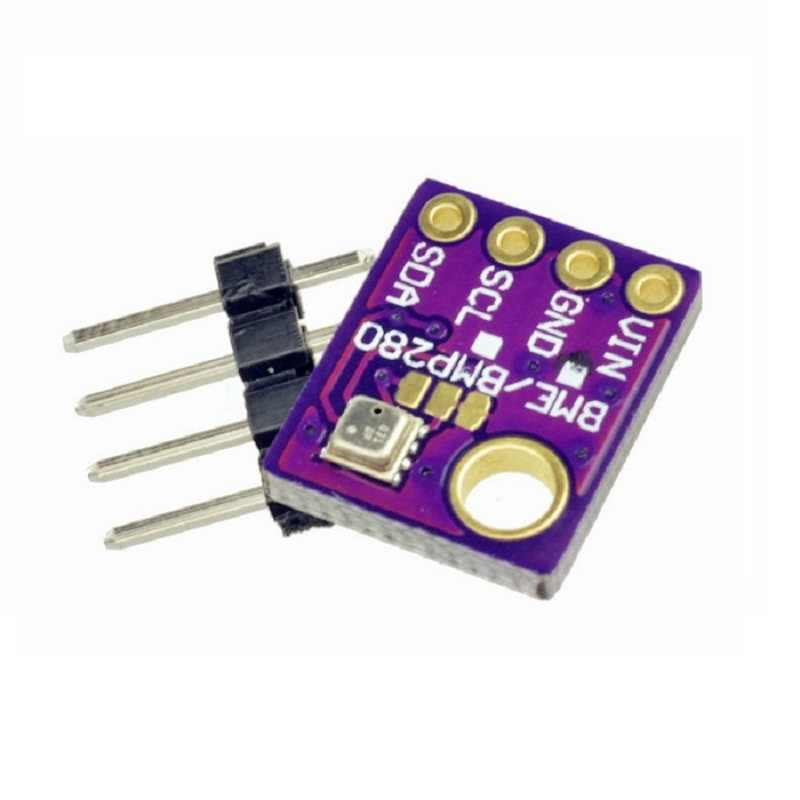
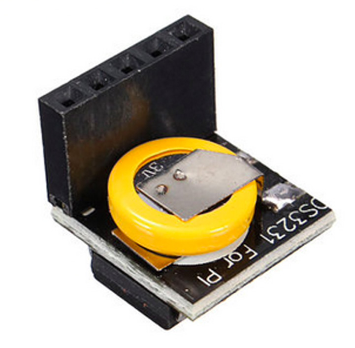
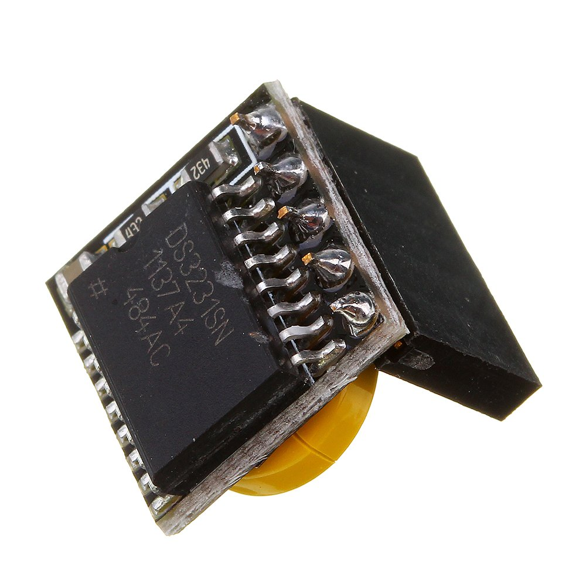

# ESPboy weather station

[Demo video](www.youtube.com)

The ESPboy weather station allows you to control time, ambient temperature, atmospheric pressure, relative and absolute humidity.
It is based on a RTC3231 and BMP280 modules.

You can buy this module ready-made or make it yourself.

## 1. Buy 

- Real time clock module [RTC3231](https://aliexpress.ru/wholesale?catId=&SearchText=ds3231%20RTC)
- Sensor humidity/temperature/atmospheric pressure [BMP280](https://aliexpress.ru/wholesale?catId=&SearchText=BMP280).
Consider the large number of defective BMP/BME280 modules on the market.

## 2. Connect RTC3231 real time clock module to ESPboy

- ''+'' -> VCC
- ''–'' -> GND
- ''D'' -> SDA
- ''C'' -> SCL

## 3. Connect BMP280 temperature/humidity/atmospheric pressure module real time clock module to ESPboy

- VCC -> VCC
- GND -> GND
- SDA -> SDA
- SCL -> SCL

## 3. Upload this firmware

NOTE: Before compilation, set Arduino IDE settings

-  Board:  ESP8266 WeMos D1 mini

## 4. Useful links

- [Buy ESPboy](https://www.tindie.com/products/23910/)
- [DIY ESPboy](https://easyeda.com/ESPboy)
- [Main Web site](https://www.espboy.com)
- [YouTube channel](https://www.youtube.com/c/ESPboy)
- [Community](https://community.espboy.com)
- [Discord chat](https://discord.gg/kXfDQpX)
- [Twitter](https://twitter.com/ESPboy_edu)
- [Software](https://github.com/ESPboy-edu)
- [Contact: espboy.edu@gmail.com](mailto:espboy.edu@gmail.com)

